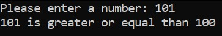

# FlatAssemblerHW1
Andreev Arkadiy BSE192

## Calculator
1) Проверка каждой из 4-ых допустимых операций (+, -, *, /).

2) Ввод некорректной арифметической операции

3) Ввод некорректного числа

4) Деление на ноль

Программа завершилась некорректно.

## ConstComparison
Программа сравнивает введенное пользователем число с заранее заданной константой (в данном случае с числом 100).
1) Ввод большего числа

2) Ввод равного числа

3) Ввод меньшего числа

4) Ввод некорректного числа

## Factorial
Программа высчитывает факториал заданного пользователем числа.
1) Ввод корректного числа

2) Ввод отрицательного числа

3) Ввод нуля

4) Ввод некорректного числа

## PrimeNumbers
Программа определяет простоту введенного пользователем числа.
1) Ввод простого числа

2) Ввод непростого числа

3) Ввод нуля

4) Ввод некорректного числа

## StringComparison
Программа сравнивает две строки, введенные пользователем.
1) Ввод одинаковых строк

2) Ввод разных строк

3) Ввод пробелов

